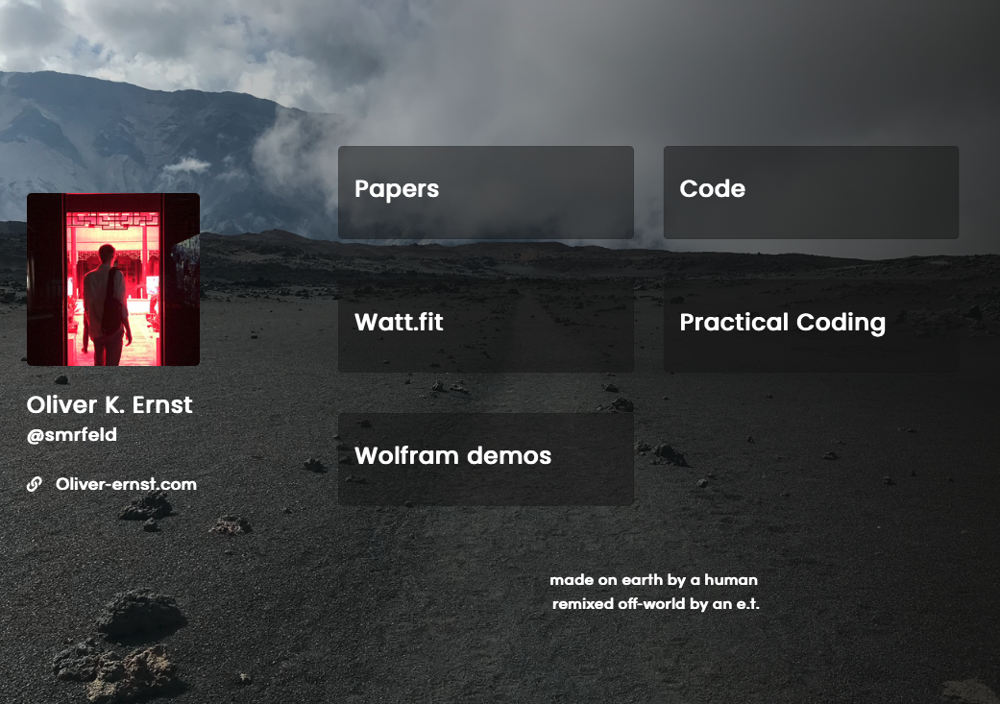
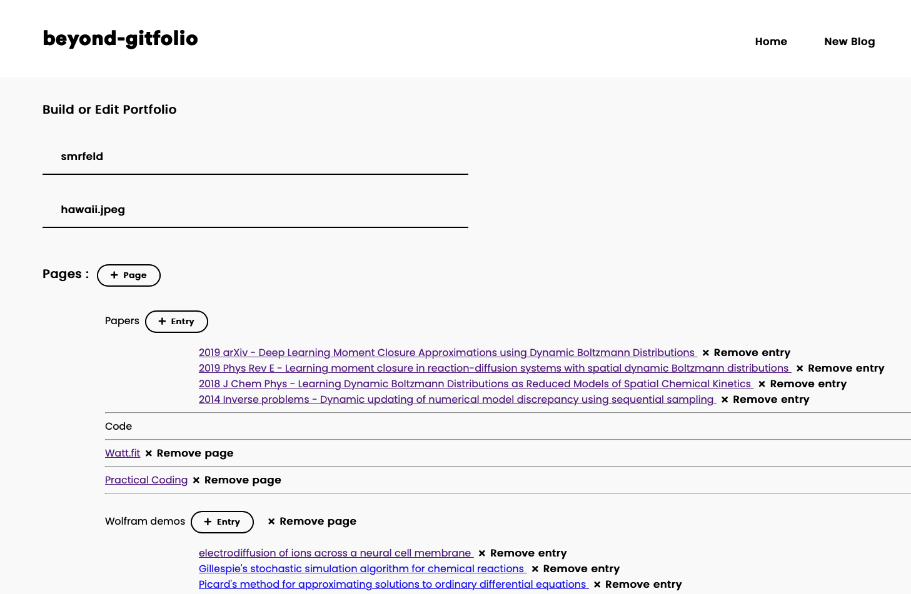

# Beyond Gitfolio 

Jekyll theme for beautiful academic website - based on the fantastic [Gitfolio](https://imfunniee.github.io/gitfolio/).

The goals of this project are to extend `Gitfolio` to:
1. Instead of repos, show different links on the homepage.
2. Move the repos to a dedicated `code` page.
3. Add a dedicated `papers` page to display academic papers.
4. Update the `gitfolio ui` so that papers can be added dynamically to the page.
5. Small stylistic changes, e.g. change the background to full page image.
6. Automatically read in `json` configuration from the previous run. Alternatively, you can edit the `json` file manually with your papers and other pages and `gitfolio ui` will parse and display it.

## Examples

An example page generated is given below, and can be found [here](https://www.oliver-ernst.com).



The user interface has been modified from `gitfolio` and can be used to add papers/links and new pages. An example screenshot is below.



## Running beyond-gitfolio

Note that the command line interface from `gitfolio` is not supported because the configuration options are more complex. Only the GUI is supported:
```
beyond-gitfolio ui
```

## Development

To install locally:
```
npm link
```
in the local dircectory which gives
```
/usr/local/bin/beyond-gitfolio -> /usr/local/lib/node_modules/beyond-gitfolio/bin/beyond_gitfolio.js
/usr/local/lib/node_modules/beyond-gitfolio -> /Users/oernst/software_public/beyond-gitfolio
```

Then run
```
beyond-gitfolio ui
```

### To-Do

1. Blog is not tested and probably broken.
2. Ability to reorganize sections.
3. Ability to choose one or two column layouts for links.
